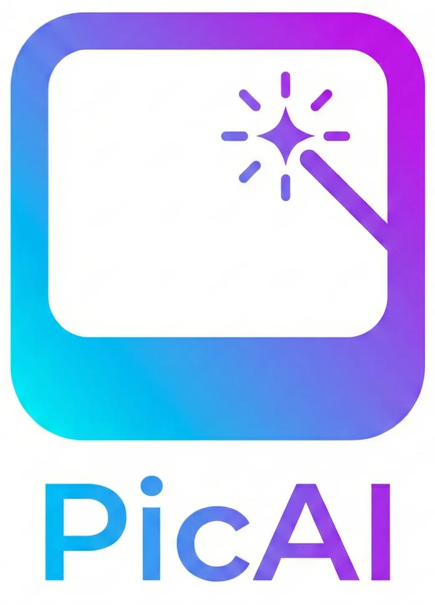

# 🎨 EditPicAI - AI Image Generation Android App

<p align="center">
  
</p>

<p align="center">
  
  
  
  
</p>

---

## 🚀 Giới Thiệu
**EditPicAI** là một ứng dụng Android hiện đại cho phép người dùng sáng tạo hình ảnh nghệ thuật thông qua sức mạnh của Trí tuệ nhân tạo (AI). Với giao diện mượt mà được xây dựng hoàn toàn bằng **Jetpack Compose**, ứng dụng mang lại trải nghiệm người dùng đỉnh cao và tốc độ xử lý nhanh chóng.

## ✨ Tính Năng Chính
- 🎨 **Style Library:** Đa dạng phong cách từ Anime, Realistic đến Cyberpunk.
- 📁 **Categories & Templates:** Duyệt qua các danh mục mẫu có sẵn để tìm cảm hứng.
- 🔐 **Secure & Fast:** Tích hợp hệ thống chữ ký bảo mật (Signature) cho các API call.
- 🌑 **Modern UI:** Giao diện tối giản, hỗ trợ Dark Mode và Material Design 3.

## 🛠️ Tech Stack
Dự án sử dụng các công nghệ mới nhất trong hệ sinh thái Android:

- **UI:** [Jetpack Compose](https://developer.android.com/jetpack/compose) - Toolkit hiện đại để xây dựng giao diện bản sắc.
- **DI:** [Hilt](https://developer.android.com/training/dependency-injection/hilt-android) - Dependency Injection mạnh mẽ.
- **Networking:** [Retrofit](https://square.github.io/retrofit/) & [OkHttp](https://square.github.io/okhttp/) - Xử lý API RESTful.
- **Async:** [Kotlin Coroutines](https://kotlinlang.org/docs/coroutines-overview.html) & [Flow](https://kotlinlang.org/docs/flow.html).
- **Architecture:** MVVM với Clean Architecture (Data, Domain, UI layers).
- **Local Storage:** [DataStore](https://developer.android.com/topic/libraries/architecture/datastore) - Lưu trữ key-value và proto dữ liệu an toàn.
- **Image Loading:** [Coil](https://coil-kt.github.io/coil/) - Thư viện tải ảnh tối ưu cho Compose.
- **Logging:** [Timber](https://github.com/JakeWharton/timber).

## ⚙️ Cài Đặt Dự Án

Để chạy dự án này trên môi trường local, bạn cần thực hiện các bước sau:

1. **Clone project:**
   ```bash
   git clone https://github.com/quanta1999/EditPicAI.git
   ```

2.**Build & Run:**
   Mở dự án bằng Android Studio (Koala hoặc mới hơn) và nhấn **Run**.

## 📂 Cấu Trúc Thư Mục
```text
app/src/main/java/apero/quanta/picai/
├── data/          # Implementations of repositories & data sources
├── domain/        # Business logic: Models, Repositories (Interfaces), UseCases
├── ui/            # UI components, Screens, ViewModels (Jetpack Compose)
├── di/            # Dependency Injection modules
├── network/       # Retrofit services, Interceptors, Adapters
└── util/          # Helper classes & Extensions
```

---
<p align="center">
  Made with ❤️ by <b>QuanTA</b>
</p>
